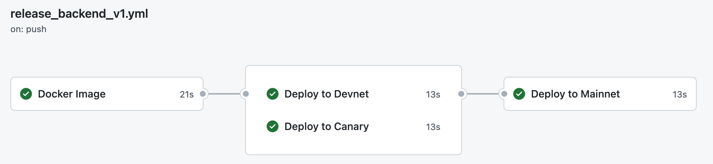
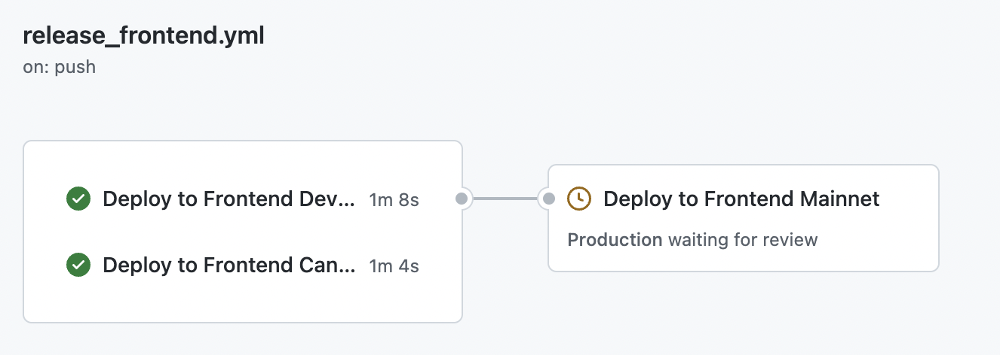
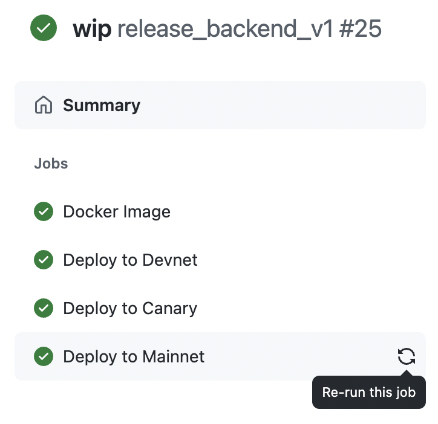
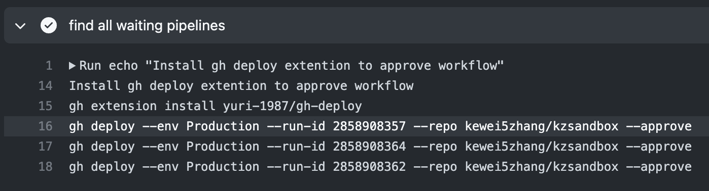
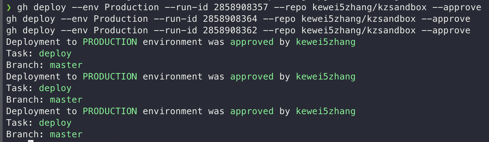

# Monorepo Multi Work Stream CD Revamp

## In Scope

- Continuous Deployment
- Environment Approvals
- Backend and Frontend Deployments

## Not In Scope

- Continuous Integration
- Release strategy
## Assumptions

- We are moving away from monorepo, we need an intermediate solution to serve our deployments in a work stream model before migrating to a multi-repo structure.

## Requirements:

- Each workstream includes steps of docker image build, devnet deployment (optional), canary deployment (optional), prod deployment.
- Approval required for prod deployment
- One-click approve all deployments
- Frontend deployment need to wait on backend deployments

## Design

1. One release pipeline per backend service includes image build, devnet deployment, canary deployment and mainnet deployment. Approval is required for mainnet deployment. image build is required for all deployment steps. canary and devnet deployments are required by mainnet deployment. This is achieved using the `needs` keyword.

2. One release pipeline for frontend service includes, devnet deployment, canary deployment and mainnet deployment. Each frontend deployment will search and wait for corresponding backend service to complete. This is achieved using `wait-on-check-action@v1.0.0` action.

3. Rollback can be managed by re-run previous jobs by commit. Helm rollback is always an option for easy rollback too.
  
4. approve all dispatch (manual) pipeline can help print out all waiting pipelines by commitID. Approver can than run `Github CLI` command manually to approve all pipelines to achieve "deploy all".

